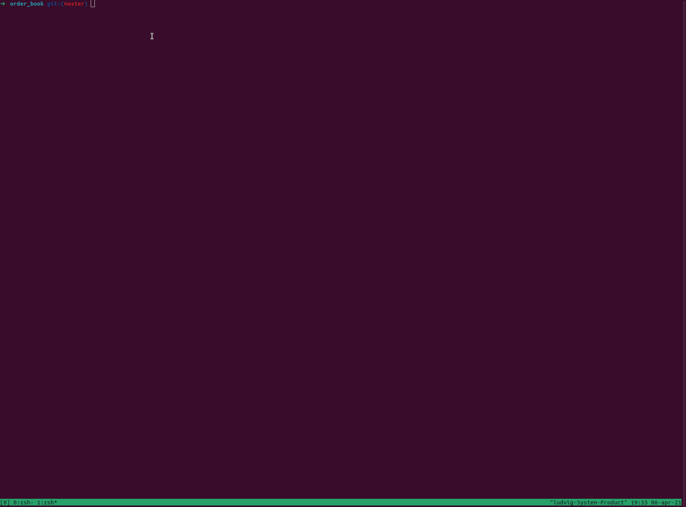

# Level 2 Order Book

**A simple level 2 order book built in Rust.**

---
You can find the order book in the engine folder.

Run the test and look at the documentation with the following commands
```
cargo t
cargo doc --open
```
But it felt boring with an empty order book so i also begin working on a cli for trading :) 

Run it like this
```
git clone git@github.com:lalamm/orderlevel2.git
//Start the server
cargo r --bin server --release
// Start 2 clients in new terminals
cargo r --bin client --release
cargo r --bin client --release
```
It's not fully featured yet so you won't be able to trade.

If you don't have access to Rust i made this gif showcasing it.



cheerio